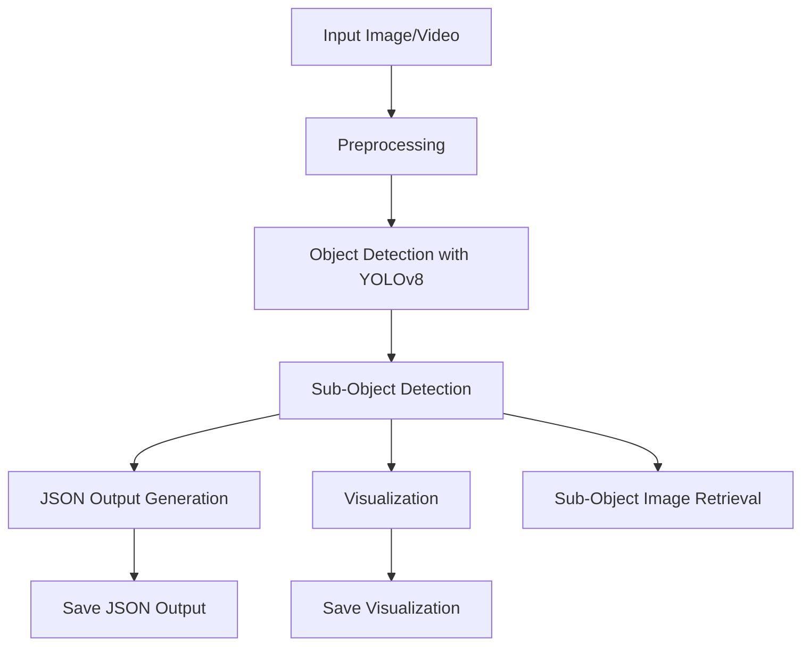

# Object Detection System

## Overview
This project implements a robust computer vision system capable of detecting objects and their associated sub-objects in a hierarchical structure. The system utilizes YOLOv8 for real-time detection and provides JSON outputs formatted according to specified requirements.

## Features
- Object and sub-object detection (e.g., "Person", "Car", "Helmet", "Tire")
- Hierarchical association of detected objects and sub-objects
- JSON output in the specified format
- Functionality to retrieve and save cropped images of specific sub-objects
- Benchmarking for inference speed (10-30 FPS on CPU)
- Modular design for easy extension

## System Architecture


## Installation
Clone the repository:
```bash
git clone https://github.com/aryan20151/object-detection-system
cd object-detection-system
```

Install the required dependencies:
```bash
pip install -r requirements.txt
```

## Usage

### For Image Input
```bash
python src/main.py --input dataset/image.jpg --output data/output
```

### For Video Input
```bash
python src/main.py --input dataset/video.mp4 --output data/output
```

### To Retrieve Specific Sub-Object Images
```bash
python src/main.py --input dataset/video.mp4 --output data/output --retrieve-subobject --object-id 1 --subobject helmet
```

## Outputs
- **Visualizations**: Saved as `visualization.jpg` in the output directory
- **JSON Results**: Saved as `detections.json` in the output directory

## Benchmarking
The system includes functionality to benchmark inference speed. Run the system on a video file to see the FPS output in the console.

## Contributing
Contributions are welcome! Please open an issue or submit a pull request for any improvements.

## License
This project is licensed under the MIT License.

## Acknowledgements
- YOLOv8 for object detection
- OpenCV for image processing